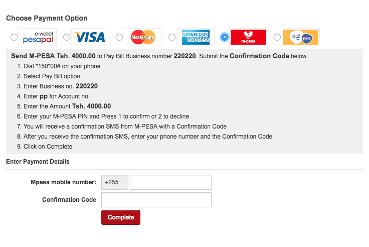
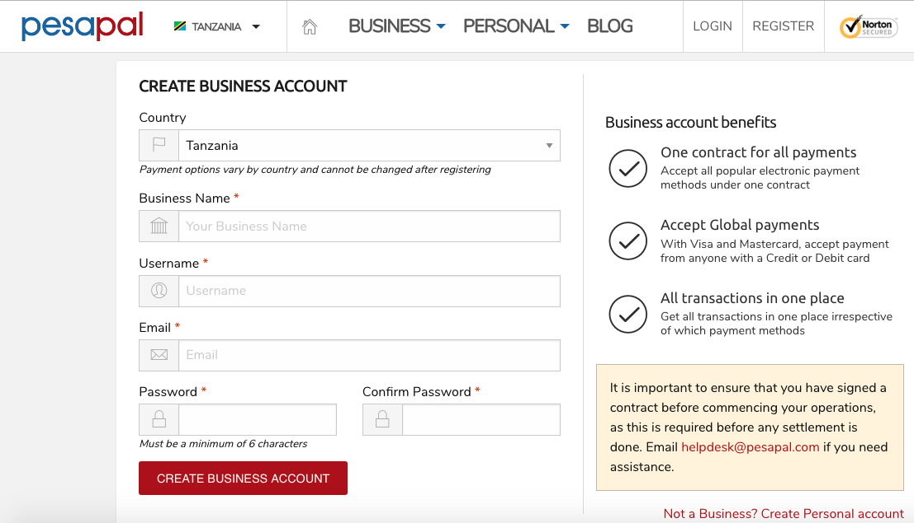
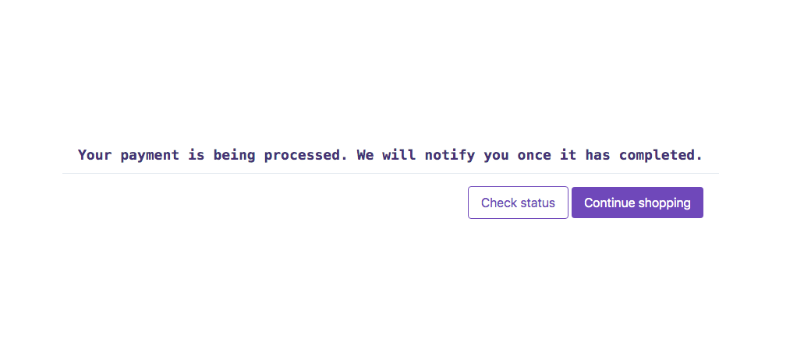

# Pesapal package for Laravel apps  

[](https://github.com/bryceandy/laravel_pesapal/actions) 
<a href="https://packagist.org/packages/bryceandy/laravel_pesapal"></a>
<a href="https://packagist.org/packages/bryceandy/laravel_pesapal"></a>
<a href="https://packagist.org/packages/bryceandy/laravel_pesapal"></a>  
<a href="https://patreon.com/bryceandy" rel="nofollow"></a>

This package enables Laravel developers to easily make use of the [Pesapal](https://www.pesapal.com) API.  

  

## Version support   

| Laravel version | Package version | Maintenance |
| --- | --- | --- |
| 5.7 - 6 | 1.0.0 - 1.0.1 | No longer maintained |
| 7 and above | 2.* | Actively maintained |  

## Installation  

Pre-installation requirements  

  * A running  or newly installed Laravel 7.* or above  
  * PHP 7.4 or above  
  * cURL extension installed  

Now run  

```bash
composer require bryceandy/laravel_pesapal
```  
 
## Configuration  
 
Next we publish the configuration file that comes with the package  

```bash
php artisan vendor:publish --tag=pesapal-config
```  

After publishing, you will find a `pesapal.php` file in your `config` directory  

Head over to [demo](https://demo.pesapal.com) if you want a testing environment or [live](https://www.pesapal.com) for a live integration and create a business account. You will obtain a key-secret pair for your integration

   

Inside your `.env` file, create these environment variables and they will be used to set configuration values available in the published `config/pesapal.php` file  

Use the keys you obtained from Pesapal to fill the key and secret. If you are on a live account, set the **is_live** variable to true.  

```dotenv
PESAPAL_KEY=yourConsumerKey
PESAPAL_SECRET=yourConsumerSecret
PESAPAL_IS_LIVE=false
PESAPAL_CALLBACK_URL=
```  

Thereafter, run the migration command as the package will load a database migration that stores the payment records    

```bash
php artisan migrate
```  

## Usage  
  
### Before making a payment, setup a callback page.  

Create a callback page and register its URL in the `PESAPAL_CALLBACK_URL` environment variable. This can be something like `http://yourwebsite.com/callback`  

Once a payment process has been completed by the user, Pesapal will redirect to your site using the url.  
 
### Making a request to Pesapal for a payment.  

Pesapal requires a request sent to their API in order to display the form like the one we [see above](#pesapal-package-for-laravel-apps )  
 
This package comes with a route `/pesapal/iframe` where you can post the data as follows:  

```php
/**
 * Create a form and send the appropriate values. You may as
 * well send url parameters where a view will be returned.
 */
[
    'amount' => 'Required, input should be numbers only',
    'currency' => 'Required, values can be TZS,KES,UGX or USD',
    'description' => 'Required, short description of the payment',
    'type' => 'Required, "MERCHANT" or "ORDER"',
    'reference' => 'Required, should be auto-generated and unique for every transaction',
    'first_name' => 'Optional',
    'last_name' => 'Optional',
    'email' => 'Required if there is no phone number',
    'phone_number' => 'Required if there is no email, include the country code. Example 255784999999',
]
```  

For the **type** field, leave the default as MERCHANT. If you use ORDER, be sure to read the Pesapal documentation first.    

When the data is posted successfully, you will have a view of the form to make payments.  

A new payment record will be recorded in your `pesapal_payments` table, now you can choose the payment option you prefer.  

### Fetching the payment status.  
 
After making the payment you will be redirected to the callback URL as mentioned above, and Pesapal will redirect with two query parameters:  

 * pesapal_merchant_reference – this is the same as `$reference` that you posted to Pesapal
 * pesapal_transaction_tracking_id - a unique id for the transaction on Pesapal that you can use to track the status of the transaction later  

With these two we can now:  

 A. Use these parameters to query the payment status to display to the user.  

Normally on your callback page you can display whatever you need to your customer to show that the payment is being processed.  
    
  
    
But because Pesapal will send the payment tracking Id which you have not recorded, you can save this unique tracking Id for your payment and also query for the payment status.  

In the controller method where you display the callback page, query the status:   
    
```php
namespace App\Http\Controllers;

use Bryceandy\Laravel_Pesapal\Facades\Pesapal;
use Bryceandy\Laravel_Pesapal\Payment;

class CallbackController extends Controller 
{
    public function index()
    {
        $transaction = Pesapal::getTransactionDetails(
            request('pesapal_merchant_reference'), request('pesapal_transaction_tracking_id')
        );
        
        // Store the paymentMethod, trackingId and status in the database
        Payment::modify($transaction);

        $status = $transaction['status'];
        // also $status = Pesapal::statusByTrackingIdAndMerchantRef(request('pesapal_merchant_reference'), request('pesapal_transaction_tracking_id'));
        // also $status = Pesapal::statusByMerchantRef(request('pesapal_merchant_reference'));

        return view('your_callback_view', compact('status')); // Display this status to the user. Values are (PENDING, COMPLETED, INVALID, or FAILED)
    }
}
```  
    
This way requires you to refresh the page because you may not know when the status has changed.  

If this does not have a good user experience, you may setup an 'IPN listener' where Pesapal notifies you when a payment status has changed.  

 B. Setting up an IPN (Instant Payment Notifications) listener.  
    
**This only applies to merchant accounts**. Create a route for your IPN listener, for example a GET request to /pesapal-ipn-listener

```php
// For Laravel 7.*
Route::get('pesapal-ipn-listener', 'IpnController');
// For Laravel 8.* onwards
Route::get('pesapal-ipn-listener', \App\Http\Controllers\IpnController::class);
```

Your IPN Controller could look like this:  

```php
namespace App\Http\Controllers;

use Bryceandy\Laravel_Pesapal\Facades\Pesapal;
use Bryceandy\Laravel_Pesapal\Payment;
use Illuminate\Support\Facades\Mail;

class IpnController extends Controller 
{
    public function __invoke()
    {
        $transaction = Pesapal::getTransactionDetails(
            request('pesapal_merchant_reference'), request('pesapal_transaction_tracking_id')
        );

        // Store the paymentMethod, trackingId and status in the database        
        Payment::modify($transaction);

        // If there was a status change and the status is not 'PENDING'
        if(request('pesapal_notification_type') == "CHANGE" && request('pesapal_transaction_tracking_id') != ''){

            //Here you can do multiple things to notify your user that the changed status of their payment
            // 1. Send an email or SMS (if your user doesnt have an email)to your user 
            $payment = Payment::whereReference(request('pesapal_merchant_reference'))->first();
            Mail::to($payment->email)->send(new PaymentProcessed(request('pesapal_transaction_tracking_id'), $transaction['status']));
            // PaymentProcessed is an example of a mailable email, it does not come with the package
        
            // 2. You may also create a Laravel Event & Listener to process a Notification to the user
            // 3. You can also create a Laravel Notification or dispatch a Laravel Job. Possibilities are endless! 

            // Finally output a response to Pesapal
            $response = 'pesapal_notification_type=' . request('pesapal_notification_type').
                    '&pesapal_transaction_tracking_id=' . request('pesapal_transaction_tracking_id').
                    '&pesapal_merchant_reference=' . request('pesapal_merchant_reference');
            
            ob_start();
            echo $response;
            ob_flush();
            exit; // This is mandatory. If you dont exit, Pesapal will not get your response.
        }
    }
}
```  

This controller method will be called every time Pesapal sends you an IPN notification until the payment is completed or has failed.

## IMPORTANT  

### Register IPN settings  

On your Pesapal dashboard find your Account Settings and click IPN Settings.  
 
Fill in your website domain for example `yourWebsite.com` and IPN listener URL, for example `yourWebsite.co.tz/pesapal-ipn-listener`.  

This is important so that Pesapal can send IPN notifications.  

## License   

MIT License.

## Contributors  

This package is based from the PHP API of [Pesapal](https://pesapal.com)  
  
  - [BryceAndy](http://bryceandy.com) > hello@bryceandy.com

## Sponsorship

If you enjoy using this package, consider contributing to the maintainer

<a href="https://patreon.com/bryceandy" rel="nofollow"></a>